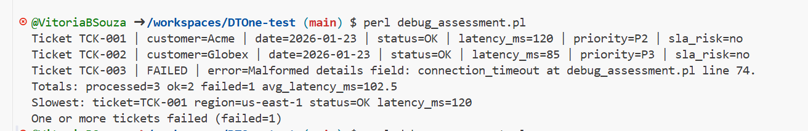
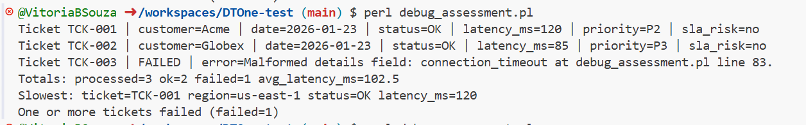
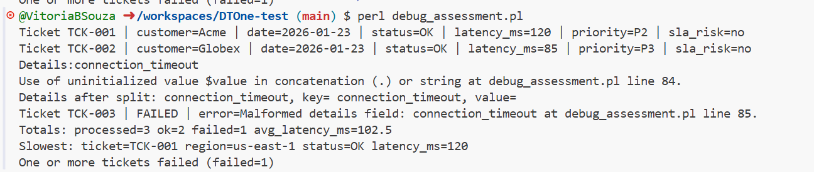
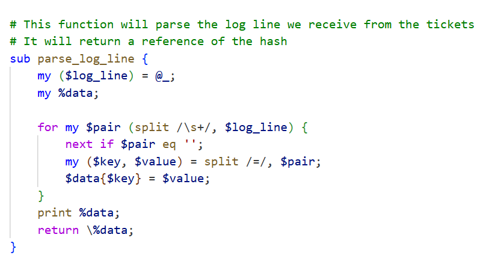
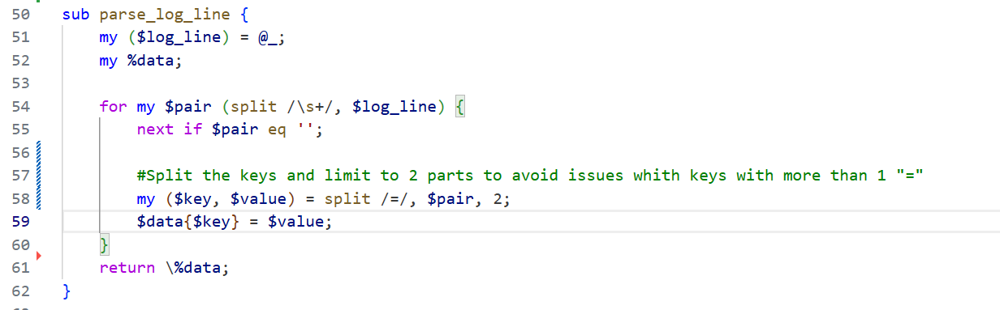
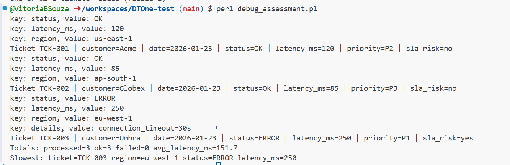

DTOne Test resolution:

Error:

The error stated on the terminal stated there is a failure while executing the process.

Before I started with the resolution I decided to document what each part of the code was used for.
This I can analize de code and it's structure before I started troubleshooting.

This is the new error printed right after I added the notes to the code.

Terminal printed 1 eror which was on line 83 which has the function parse_timeout_seconds that parses the details value and splits the "s" at the end and turns the value into an integer.

This function will throw an error if the value is malformed or missing. To troubleshoot I will print $details so I have full information on what is returning before we return the $value.

As shown on the terminal it failed while exuting the code on TCK-003 probably due to $details value is malformed.

If we print the full composition of details ($key, $value) separatedly we will see value is blank.

According to process_ticket function we should get the details from the log which countains the parse_log_line.

If we check the parse_log_line we will notice how the data is parsed which is only to split in the first =. We need to change to make it also parse the = inside the values.

If we print the %key and $value of the function we will see details key it's returning the value as connection_timeout instead of the full string.

We need to correct the part of the split so I had to research how to do it for perl. 

The best way was to first split only the 2 keys and then process the details key separetedly so we can apply a condtion in which if the key is "details" then we will assign the value to $key. This way it will will print "connection_timeout=30s".

Then the parse_timeout_second function will no longer return an error.

