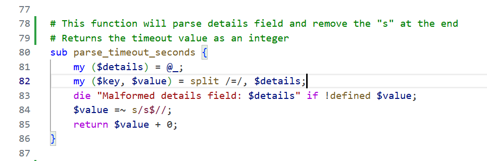
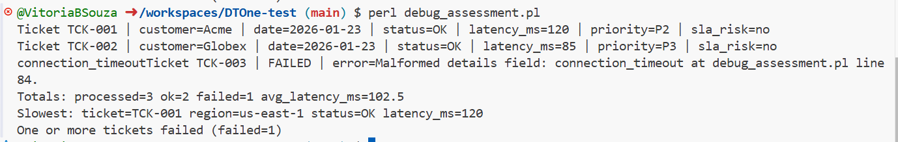
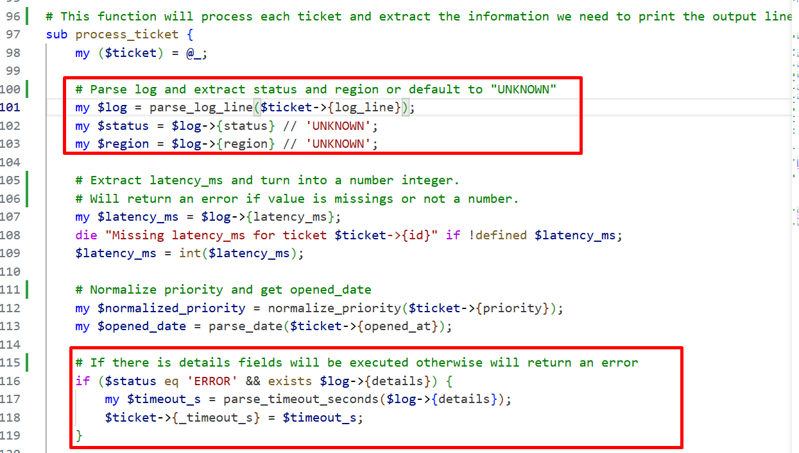
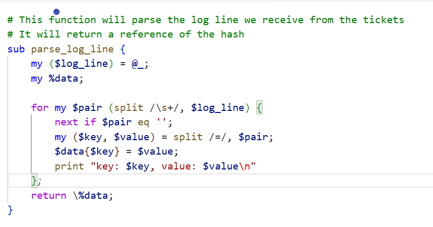
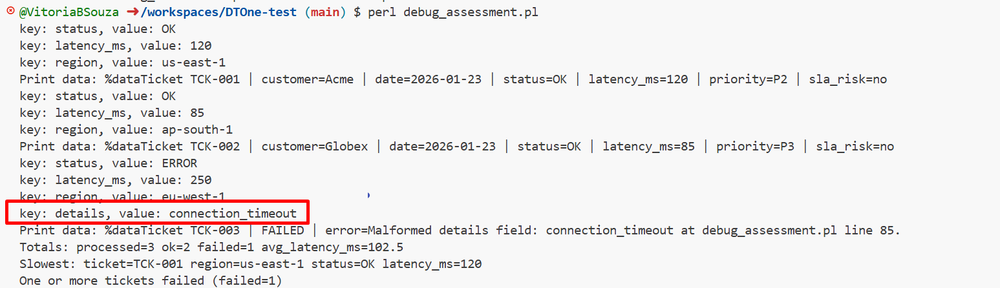

# DTOne Test Solution:

## Error:

Before starting to troubleshoot, I decided to document what each part of the code was used for. This helped me analyze the code and its structure before beginning the debugging process.

This is the new error printed right after I added the notes to the code:

## Solution:

Based on the last screenshot the terminal indicates and error on line 83 that has the parse_timeout_seconds function.

This function it parses the details value, removes the trailing "s" and converts the value into an integer. It will also throw an error if the value is malformed or missing. 

To troubleshoot, I printed $details to see the full value being passed before returning $value.

As shown on the terminal it failed while excuting the code on TCK-003 probably due to $details value is malformed or missing.

When printing the full composition of details ($key and $value) separately, it became clear that $value was empty.

According to the process_ticket function, the details value should come from the parsed log line using the parse_log_line function.

If we check the parse_log_line, it became clear that the data was being parsed by splitting only on the first "=".

By printing the $key and $value inside this function, I confirmed that the details key was returning only connection_timeout instead of the full string.

I understood that in order to solve the error I had to correct the the split. The correct approach based on my reasear for perl was to split the string into only two parts (key and value) and preserve everything after the first "=".

More details here: https://perlmaven.com/perl-split

This allows the details field to correctly contain connection_timeout=30s.

With this change, the parse_timeout_seconds function no longer throws an error.

To finish I deleted all the prints added by me on the code to leave it clean.